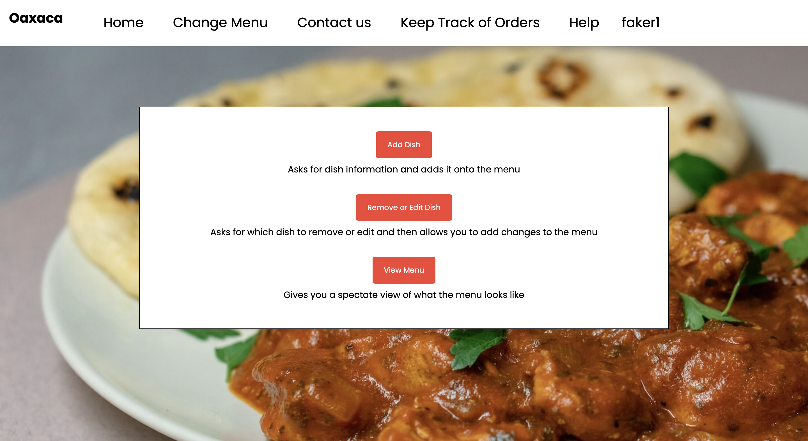
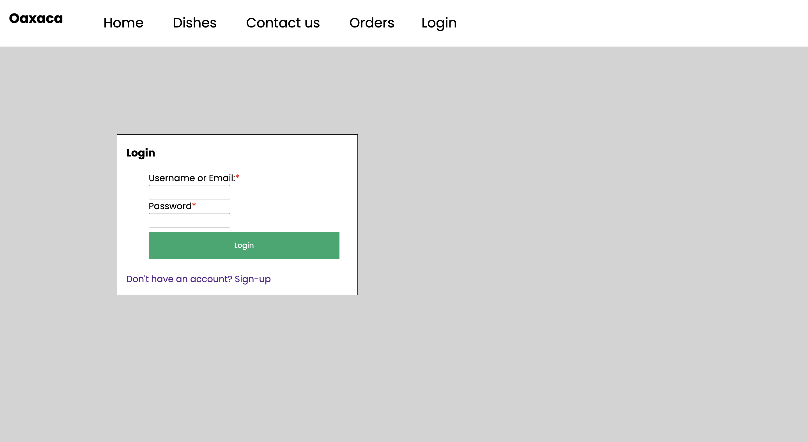
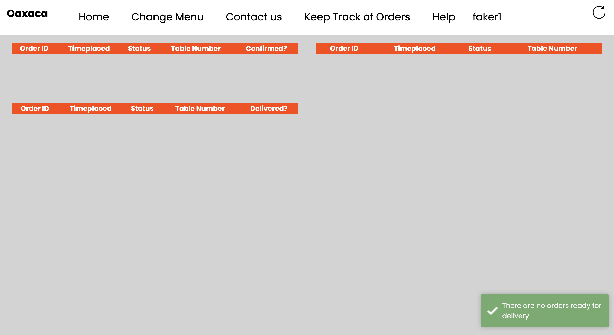

# Team Project - Restaurant Management System

This project is a Restaurant Management System that has been developed for Oaxaca.
It aims to reduce the need for hiring/training waiting stuff whilst maximising customer satisfaction.

## Table of Contents

* [General Information](#general-information)
* [Technologies Used](#technologies-used)
* [Features](#features)
* [Setup](#setup)
* [Screenshots](#screenshots)

## General Information

This Restaurant Management System can aid restaurants in streamlining their different processes.
It simplifies a wide variety of processes for the waiters, kitchen staff, and even customers.
The most crucial aspect of this project is that it simplifies the ordering process for every entity.
A customer can make an order to their table. This order is then automatically assigned to a single
waiter to prevent confusion. This waiter will be responsible for delivering the order to the table,
and assisting the customer if they ask for help.

Once an order has been confirmed, the kitchen staff
get a notification with the timestamp (to ensure that customers receive their orders in timely fashion),
and they are able to "start cooking" it. Once it has been cooked, the kitchen staff can mark it as "ready",
which will notify the waiter to deliver to the customer. Once it has been delivered, the waiter can mark the order
as complete.

This project has a wide spectrum of functionalities, which are expanded on in the [Features](#features) section.

## Technologies Used

### Backend

* Springboot
* Thymeleaf
* MySQL Workbench
* MySQL Database
* JavaScript
* Java

### Frontend

* Toastr Library
* jQuery
* HTML
* CSS

### IDEs

* Eclipse
* IntelliJ

## Features

### Menu Management

The waiter can add, edit and remove items from the menu. There are a variety of fields
to describe menu items, including images, item name, description, ingredients etc. There are also
menu filters to separate the items, thus making the menu more intuitive.

### Order Processing

The customer can make an order according to their table number. This order (as well as the
table number) is assigned to a single waiter, who will manage its delivery and assist the customer
if required. Once an order has been confirmed, the kitchen staff
get a notification with the timestamp (to ensure that customers receive their orders in timely fashion),
and they are able to "start cooking" it. Once it has been cooked, the kitchen staff can mark it as "ready",
which will notify the waiter to deliver to the customer. Once it has been delivered, the waiter can mark the order
as complete.

There are clear states for an order:

* Confirmed
* Cooking
* Ready for Delivery
* Delivered

### Users

Different entities are able to log in to the system, including customers, waiters, and kitchen staff.
Their permissions will differ according to their role. For example, a waiter can mark an order as "delivered"
whereas kitchen staff cannot.

### Notifications

Using the Toastr library, we have added a number of notifications. For example, if a customer adds an item
to their basket, they will get a notification at the bottom right of their screen.

### Customer Service

Customer service is the heart of any restaurant business, and that is why this system makes it easy
for customers to ask for help. They simply need to click a button on the page, which will notify
the waiter to promptly assist the customer.

## Setup

1. Install Eclipse or IntelliJ, as well as MySQL Workbench and MySQL.
2. Ensure that MySQL server is running.
3. Clone the repository.
4. Run the SQL file which is in the repository to set up the database. This is done in MySQL Workbench.
5. In the IDE, run the "RestaurantApplication" file.
6. Access the site on "localhost:8080/home".

Here is a setup video for further clarity:
INSERT VIDEO LINK HERE

## Screenshots

Here are some screenshots from the project to give you an idea of how we have structured the system:

To explore all the pages, view the video in which we explain every aspect of the system.

